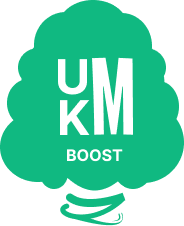

# UMKM Boost


## Video Demo
[Lihat Video Demo](https://drive.google.com/drive/folders/1HjDNAN8xxAvDQTRIyiKzKLM-HUm2eBcf)

UMKM Boost adalah platform AI-first bagi pelaku UMKM Indonesia untuk membuat ide konten, caption, dan layout poster tanpa ribet. Dengan UI mobile-first dan tombol besar, pengguna bisa menghasilkan materi promosi siap pakai dalam hitungan detik. Setiap output dipandu konteks Bahasa Indonesia dan rekomendasi CTA sehingga pemilik warung, kedai kopi, butik, hingga jasa rumahan dapat langsung mem-posting ke Instagram, Facebook, atau WhatsApp tanpa tim kreatif. Platform memadukan koleksi contoh promosi lokal dengan API AI generatif agar hasil tetap relevan, ringan, dan mudah dijelaskan ke juri atau klien. Tidak perlu login atau biaya berlangganan—cukup isi form singkat dan salin hasilnya.

## Tools yang Tersedia
- AI Ide Konten Promosi (3 ide relevan per permintaan)
- AI Caption Generator (tone friendly/profesional/casual, lengkap CTA dan hashtag)
- Pengelolaan produk agar bisa dipromosikan berkali-kali

## Tech Stack
- **Frontend**: HTML5, CSS3, Vanilla JavaScript
- **Backend**: Node.js (Netlify Functions)
- **Database & Auth**: Supabase
- **AI**: Google Gemini API
- **Hosting**: Netlify

## Struktur Folder
```
├── assets/          # Aset statis (gambar, ikon, data SQL, instruksi prompt)
├── netlify/         # Serverless functions untuk backend API (Gemini, Auth, Products)
├── src/             # Source code frontend (CSS, JS, FontAwesome)
├── *.html           # Halaman-halaman web utama (index, ideas, caption, poster)
└── TUTORIAL.md      # Panduan instalasi lokal
```

## Manfaat Utama
- Hemat waktu: form singkat → hasil instan
- Konten siap posting untuk Instagram, Facebook, TikTok, dan WhatsApp
- Bahasa Indonesia natural dengan CTA jelas
- Antarmuka mobile-first dengan tombol besar ramah pemula

## Kelebihan Platform
- Gratis
- Ringan
- Copy-to-clipboard plus toast feedback
- Berbasis contoh promosi lokal agar lebih relevan

## URL Akses
[UMKM Boost](https://umkm-boost.netlify.app)

## Instalasi Lokal
Panduan lengkap untuk menjalankan proyek ini di komputer lokal dapat dilihat di [TUTORIAL.md](./TUTORIAL.md).

## Lisensi
Proyek ini dilisensikan di bawah [MIT License](./LICENSE).

## Creator
- MieAyamCoder ([FAYnim](https://github.com/FAYnim), [farhansyahbanna](https://github.com/farhansyahbanna), [JASMINE1018](https://github.com/JASMINE1018), [Brendataaa079](https://github.com/Brendataaa079), [zamaror](https://github.com/zamaror))

---
Event [IMPHNEN x KolosalAI](https://hackathon.imphnen.dev/)